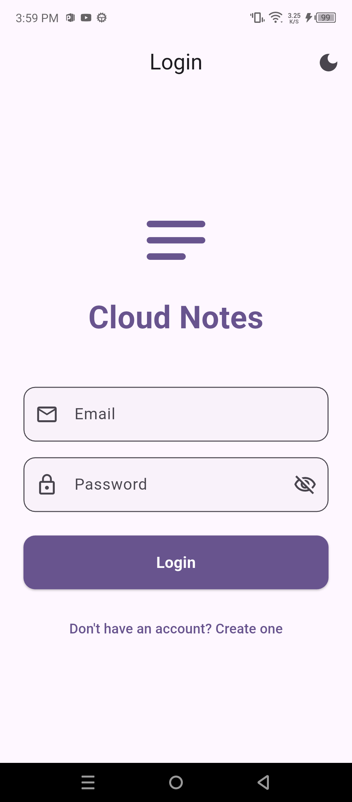
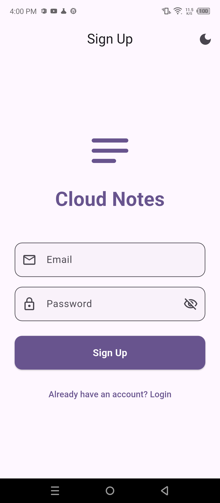
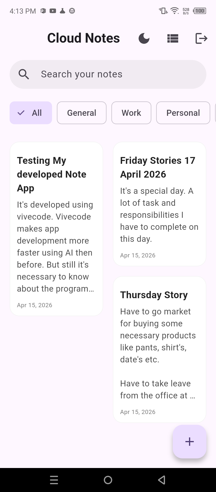
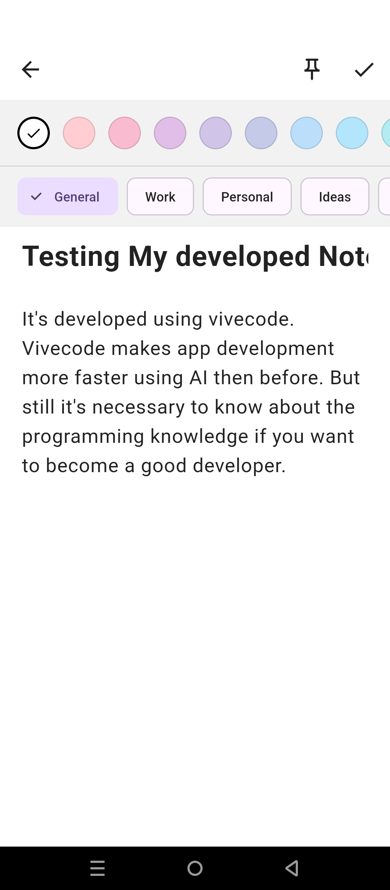
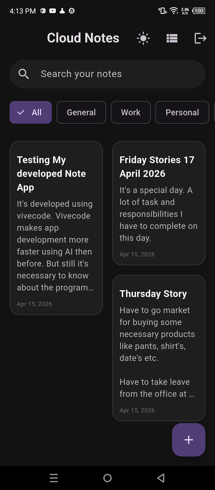
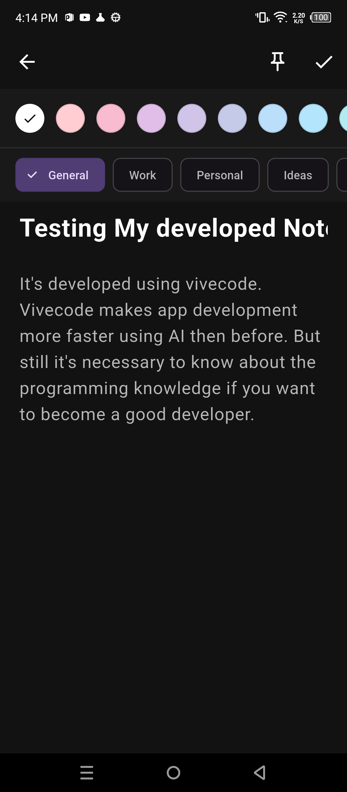
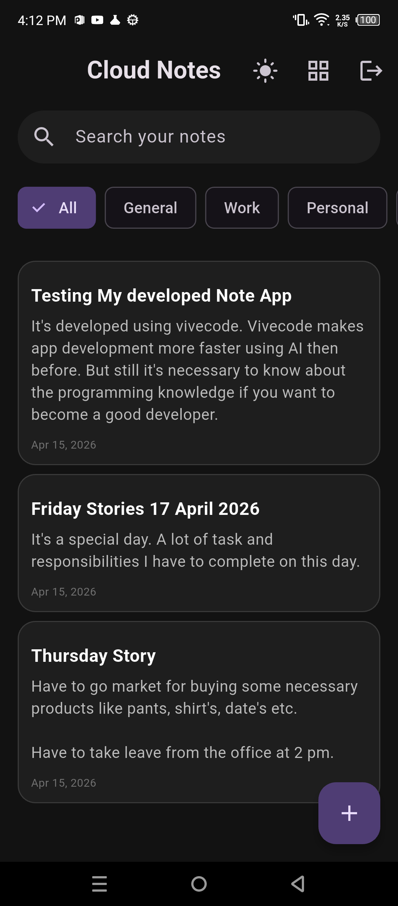
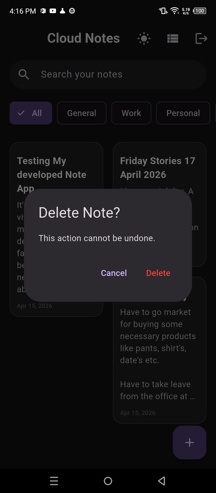

# Cloud Notes - Interview Ready Flutter App

A modern, high-performance Notes Application built with **Flutter**, **Firebase**, and **Provider** following the **MVVM (Model-View-ViewModel)** architecture. This project is designed to be "Interview-Ready," demonstrating clean code, scalable structure, and real-time cloud synchronization.

---

## 1. What the App is
Cloud Notes is a cross-platform application that allows users to create, manage, and sync their notes in real-time. It features secure user authentication, beautiful Material 3 design, dark/light mode support, note pinning, and categorization. It ensures data is always safe in the cloud and accessible across devices.

---

## 2. How it Looks
### Light Mode
| Login | Sign Up | Home (Grid) | Note Editor |
| :---: | :---: | :---: | :---: |
|  |  |  |  |

### Dark Mode
| Home (Grid) | Note Editor | Search/Filter | Delete Confirm |
| :---: | :---: | :---: | :---: |
|  |  |  |  |

---

## 3. Architecture: MVVM (Model-View-ViewModel)
We followed the **MVVM** pattern to ensure a strict separation of concerns:
- **Model**: Represents the data structure (`Note`, `UserModel`).
- **View**: The UI layer that displays data and sends user actions to the ViewModel.
- **ViewModel**: Acts as a bridge, holding the business logic and state, notifying the View when data changes.
- **Repository**: Handles data sourcing (Firebase Firestore/Auth), keeping the ViewModel clean of API-specific code.

---

## 4. What we learned from this project
- **Clean Architecture**: How to organize a project into layers for better maintainability.
- **State Management**: Using `Provider` and `ChangeNotifier` to manage complex app states.
- **Firebase Integration**: Mastery of Firebase Auth and Real-time Firestore synchronization.
- **Advanced UI/UX**: Implementing Staggered Grids, Masonry layouts, and smooth Container Transform animations.
- **Theme Management**: Implementing a user-controlled Dark/Light mode system.
- **Database Optimization**: Understanding Composite Indexing and secure Security Rules.

---

## 5. Keyword Definitions & Work Descriptions
- **Provider**: A wrapper around InheritedWidget to make state management easier and more reusable.
- **ChangeNotifier**: A class that provides change notifications to its listeners.
- **Firestore**: A flexible, scalable NoSQL cloud database to store and sync data.
- **FirebaseAuth**: A service that provides backend services to authenticate users in the app.
- **StreamBuilder**: A widget that builds itself based on the latest snapshot of interaction with a Stream (Real-time updates).
- **Staggered Grid**: A layout where items have different heights but fixed widths (like Pinterest).
- **OpenContainer**: A Material motion pattern that creates a transition between a small component and a full-screen view.
- **Composite Index**: A database index that is built on multiple fields (e.g., `userId` + `timestamp`).

---

## 6. Architecture Flow
1. **User interacts** with the **View** (e.g., clicks "Add Note").
2. The **View** calls a method in the **ViewModel**.
3. The **ViewModel** requests the **Repository** to save data to **Firebase**.
4. **Firebase** updates the data.
5. The **Repository** sends the new data back via a **Stream**.
6. The **ViewModel** receives the stream and calls `notifyListeners()`.
7. The **View** rebuilds automatically to show the new note.

---

## 7. Development File List & Reasons
| File | Reason for development |
| :--- | :--- |
| `note_model.dart` | Defines what a "Note" looks like (id, title, color, pin status). |
| `auth_repository.dart` | Encapsulates all Firebase Authentication logic for reusability. |
| `note_repository.dart` | Handles all Firestore CRUD operations (Create, Read, Update, Delete). |
| `note_viewmodel.dart` | Manages note state, search queries, categories, and sorting logic. |
| `theme_viewmodel.dart` | Manages the Dark/Light mode state across the app. |
| `home_screen.dart` | The main dashboard featuring the Staggered Grid and Category filters. |
| `add_edit_note_screen.dart` | The detailed editor with color picking and pinning functionality. |
| `login_screen.dart` | Handles user authentication with visibility toggles and clean UI. |
| `main.dart` | The entry point where we initialize Firebase and configure MultiProvider. |

---

## 8. Step-by-Step Development Guide
1. **Setup**: Create Flutter project and add dependencies in `pubspec.yaml`.
2. **Models**: Create `Note` and `User` models with `fromMap` and `toMap` methods.
3. **Repository Layer**: Build the Firebase Auth and Firestore logic wrappers.
4. **ViewModel Layer**: Create ViewModels to handle state using `ChangeNotifier`.
5. **Theme Layer**: Implement Dark Mode logic using `ThemeData`.
6. **Authentication UI**: Build Login/Signup screens and connect them to `AuthViewModel`.
7. **Home UI**: Implement the real-time note list using `StreamBuilder` and Staggered Grid.
8. **Editor UI**: Build the add/edit screen with Container Transform animations.
9. **Final Polish**: Handle errors, add loading indicators, and clean up Dart Analysis warnings.

---

## 9. Required Dependencies
```yaml
dependencies:
  firebase_core: ^3.10.1    # Initialize Firebase
  firebase_auth: ^5.4.1    # User Login/Signup
  cloud_firestore: ^5.6.2  # Real-time Database
  provider: ^6.1.2         # State Management
  intl: ^0.20.2            # Date Formatting
  animations: ^2.0.11      # Premium UI Transitions
  flutter_staggered_grid_view: ^0.7.0 # Masonry Grid Layout
```

---

## 10. Firebase Connection Guide
### Step 1: Console Setup
- Create a project on [Firebase Console](https://console.firebase.google.com/).
- Add an **Android App** with the package name: `com.example.notes_app_with_firebase`.

### Step 2: Configuration Files
- Download `google-services.json`.
- Place it in: `android/app/google-services.json`.

### Step 3: Dependency Declaration
- **Project-level** `build.gradle.kts`: Add `classpath("com.google.gms:google-services:4.4.2")`.
- **App-level** `build.gradle.kts`: Add `id("com.google.gms.google-services")` and Firebase dependencies.

### Step 4: Database & Auth
- Enable **Email/Password** in the Auth tab.
- Create **Cloud Firestore** in "Test Mode".

### Step 5: Security Rules
Apply these rules to ensure users can only see their own notes:
```javascript
match /notes/{noteId} {
  allow read, update, delete: if request.auth != null && request.auth.uid == resource.data.userId;
  allow create: if request.auth != null;
}
```

### Step 6: Indexing
Firestore requires a **Composite Index** to sort notes by time for a specific user. 
- Collection ID: `notes`
- Fields: `userId` (Ascending), `timestamp` (Descending).
- Click the link provided in the app console/logcat to create it automatically.
